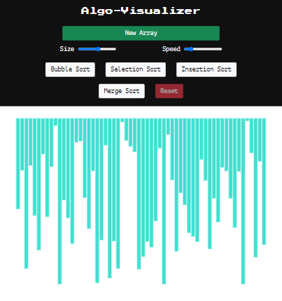
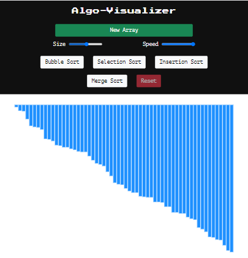

# Algo-Visualizer
[Website Link](https://karans1314.github.io/Algo-Visualizer/)   
 
  
  
  
#### A web app built in JavaScript/DOM and HTML/CSS for visualizing a bunch of different sorting algorithms like:
- Bubble Sort 
- Selection Sort
- Insertion Sort
- Merge Sort

#### Implementation of functions to create a random new array, vary the size, reset and change the speed of the algorithm as they run.  
#### Thanks to: [Clément Mihailescu](https://www.youtube.com/watch?v=pFXYym4Wbkc) for the project idea.
